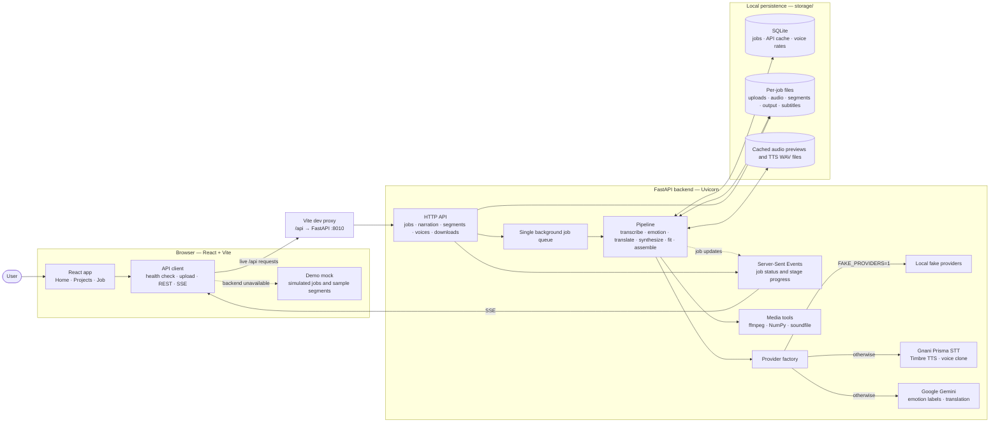

# Vani system diagram

This diagram reflects the current implementation. The frontend can run against
the live FastAPI backend or fall back to an in-browser demo when the backend is
unavailable.

## Runtime architecture

In development, Vite serves the frontend at port `5173` and proxies `/api` to
the backend at port `8010` (overridable with `API_PORT`). The frontend selects
live or demo mode once at startup. Fake providers exercise the real backend
pipeline locally without calling paid services.

## Job lifecycle and media flow

```mermaid
flowchart TD
    Upload["Upload video and choose dub or narrate"]
    Validate["Validate video, duration, streams, and upload size"]
    Job["Create and persist job"]
    IsNarrate{"Narrate mode?"}
    Wait["Wait for user narration upload and offset"]
    Ingest["Extract/resample audio with ffmpeg<br/>STT audio at 16 kHz; mix audio at 48 kHz"]
    STT["Transcribe audio<br/>Gnani Prisma or local fake"]
    Normalize["Normalize timestamped segments<br/>derive timing slots"]
    Emotion["Analyze audio features and label emotions"]
    Review["Human reviews transcript and emotions"]
    Settings["Choose voice and background-audio behavior"]
    IsOwn{"Own narration voice?"}
    Translate{"Target language differs?"}
    TranslateStage["Translate lines to fit duration budgets<br/>Gemini or local fake"]
    Clone{"Clone voice?"}
    Embed["Build/reuse voice embedding<br/>from a consented reference"]
    TTS["Synthesize non-kept lines<br/>Gnani Timbre/clone or local fake"]
    Fit["Fit each line to its original time slot"]
    Assemble["Place lines on the 48 kHz timeline<br/>normalize and mix"]
    Clean["Clean and place the user's narration"]
    Mux["Mux audio with original video<br/>duck or mute background; exact video duration"]
    Artifacts["Save MP4 and source/target SRT subtitles"]
    Done["Persist completed job and expose downloads"]

    Upload --> Validate --> Job --> IsNarrate
    IsNarrate -->|"yes"| Wait --> Ingest
    IsNarrate -->|"no"| Ingest
    Ingest --> STT --> Normalize --> Emotion --> Review --> Settings --> IsOwn
    IsOwn -->|"yes"| Clean --> Mux
    IsOwn -->|"no"| Translate
    Translate -->|"yes"| TranslateStage --> Clone
    Translate -->|"no"| Clone
    Clone -->|"yes"| Embed --> TTS
    Clone -->|"no"| TTS
    TTS --> Fit --> Assemble --> Mux
    Mux --> Artifacts --> Done
```

Job progress is persisted as each stage runs and streamed to the browser over
SSE. The single worker processes one job at a time; within synthesis, up to
three segment requests can run concurrently. Paid provider results are cached
so interrupted work and repeated requests can reuse completed results.
